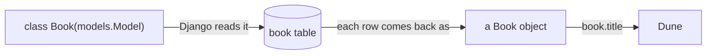

# Design a model

## The big idea

A backend needs to **remember** things between requests: users, tasks, books.
It keeps them in a **database**. A database stores data in **tables**, and a
table looks a lot like a pandas DataFrame: it has named **columns**, and each
**row** is one record.

| id | title | author | published_year | is_available |
|---|---|---|---|---|
| 1 | Dune | Frank Herbert | 1965 | True |
| 2 | 1984 | George Orwell | 1949 | True |

The difference from a DataFrame is that a database table is **strict**. You
decide up front what every column is called, what type it holds (text, whole
number, true/false, date) and what's allowed in it. The database then refuses
anything that doesn't fit.

In Django you don't write that table by hand. You write a Python **class** called
a **model**, and each attribute of the class becomes one column. Django reads the
class and creates the table for you. Later, each row comes back to you as a Python
**object** of that class, so `book.title` gives you the title of that one book.



## New words

| word | meaning |
|---|---|
| **database** | The program that stores your app's data permanently, in tables. |
| **table** | One kind of thing, like books. Columns are the fields, rows are the records. |
| **model** | A Python class that describes one table. Django builds the table from it. |
| **field** | One attribute of a model, like `title = models.CharField(...)`. It becomes one column. |
| **object / instance** | One row, as a Python value. `Book(title="Dune")` makes one. |
| **`NULL` / `None`** | "No value". The database calls it `NULL`, Python calls it `None`. |
| **method** | A function written inside a class. It works on one object, called `self`. |
| **migration** | A file that tells the database how to change its tables to match your models. |
| **ORM** | The part of Django that turns Python like `Book.objects.create(...)` into database commands, so you never write SQL yourself. |

## What your code receives and returns

This exercise is a bit different: **there's no function for the tests to call.**
You write the `Book` class in `sandbox/models.py`, and the tests **use your class**.
Before the tests run, the grader builds the database table from your model (in a
real project you'd do that with `makemigrations` and `migrate`, see below).

These lines are copied from the tests, with what they expect:

```python
Book._meta.get_field("title").max_length      # expects 200
Book._meta.get_field("author").max_length     # expects 100

book = Book.objects.create(title="Dune", author="Frank Herbert")
book.is_available                             # expects True (nobody set it)
book.created_at                               # expects a date and time, not None

str(Book(title="Dune", author="Frank Herbert"))    # expects "Dune by Frank Herbert"
```

For ordering, the tests create three books called `"Neuromancer"`, `"Dune"` and
`"Foundation"` (in that order), then ask for all of them **without** saying how
to sort. They expect `["Dune", "Foundation", "Neuromancer"]`: alphabetical by title.

For `is_classic()` they expect:

| book | `book.is_classic()` |
|---|---|
| `Book(title="1984", author="Orwell", published_year=1949)` | `True` |
| `Book(title="Dune", author="Herbert", published_year=1965)` | `False` |
| `Book(title="X", author="Y", published_year=1950)` | `False` (1950 is not *before* 1950) |
| `Book(title="Unknown", author="Anon")` (no year) | `False` |

> `Book._meta.get_field("title")` is how the tests look up a field on your class.
> You won't need `_meta` in your own code.

## Tools you'll use

Your file starts with `from django.db import models`, so every field type below
is written `models.Something(...)`.

### `models.CharField(max_length=...)`

- A column for **short text**, like a name or a title.
- `max_length` is **required**: the most characters the column can hold.
- The starter already has one, `title`, so you can check it in the Console:

```python
field = Book._meta.get_field("title")
print(field.max_length)   # 200
```

### `models.PositiveIntegerField(null=True, blank=True)`

- A column for **whole numbers of 0 or more**. Good for years, ages, counts.
- Every field is **required** unless you say otherwise. To make it **optional**
  you need two options, and they do different jobs:
    - `null=True`: the **database** may store `NULL` (no value) in this column.
    - `blank=True`: **checking** of input (forms, and later serializers) lets the
      user leave it empty.
- When an optional field isn't given, its value is `None`.

### `models.BooleanField(default=True)`

- A column for `True` / `False`.
- `default=...` is the value used when nobody sets one. It works on any field type.

### `models.DateTimeField(auto_now_add=True)`

- A column for a date and a time.
- `auto_now_add=True` means Django fills it in **by itself**, once, when the row
  is first saved. You never set it yourself.

### Making and saving objects

- `Book(title="Emma")` makes an object **in memory only**. It isn't saved and has
  no id yet (`pk` is `None`).
- `.save()` writes it to the database. `Book.objects.create(...)` makes **and**
  saves in one step.

```python
book = Book(title="Emma")
print(book.title)    # Emma
print(book.pk)       # None  (not saved yet)
book.save()
print(book.pk)       # 1     (the database gave it an id)
saved = Book.objects.create(title="Beloved")
print(Book.objects.count())   # 2
```

The Console starts with an empty database each time you run something.

### `class Meta:` and `ordering`

- A small class written **inside** your model, indented under it. It holds
  settings about the table as a whole, not about one column.
- `ordering = ["title"]` means "unless I say otherwise, sort by title, A to Z".
  A `-` in front, like `["-title"]`, means Z to A. It's a **list**, so it needs
  the square brackets.

- The shape is: inside `Book`, a line `class Meta:`, and under it, indented one
  more level, the line `ordering = [...]`.
- Without it, books come back in whatever order the database likes (usually the
  order they were saved). You can also sort one query by hand with
  `.order_by(...)`, which takes the same kind of names:

```python
for title in ["Emma", "Persuasion", "Beloved"]:
    Book.objects.create(title=title)
print(list(Book.objects.values_list("title", flat=True)))                     # ['Emma', 'Persuasion', 'Beloved']
print(list(Book.objects.order_by("-title").values_list("title", flat=True)))  # ['Persuasion', 'Emma', 'Beloved']
```

`values_list("title", flat=True)` gives just the titles, like picking one column
from a DataFrame. The first line shows the saved order. Once your `Meta` is in
place, the first line prints them A to Z instead.

### `def __str__(self):` and other methods

- A **method** is a function written inside a class, indented one level. Its
  first parameter is always `self`, which means "the one object this was called
  on". Inside, `self.year` is that object's year.
- `__str__` is a special method: Python calls it when you do `print(obj)` or
  `str(obj)`. It must **return** a string.
- Here's a plain Python class (not a model) with both kinds of method:

```python
class Film:
    name = "Alien"
    year = 1979

    def __str__(self):
        return f"{self.name} ({self.year})"

    def is_old(self):
        return self.year < 1990

film = Film()
print(film)            # Alien (1979)
print(film.is_old())   # True
```

- You call your own methods with brackets, `film.is_old()`, but never pass
  `self` in yourself. Python does that for you.

### Checking for `None` first

- Comparing `None` with a number crashes:
  `None < 1950` gives `TypeError: '<' not supported between instances of 'NoneType' and 'int'`.
- So check for `None` **before** comparing. `and` stops early: if the left side is
  `False`, the right side never runs.

```python
score = None
print(score is not None and score > 50)   # False (no crash)
score = 72
print(score is not None and score > 50)   # True
```

**Try it:** paste any example above into the editor, highlight it and press
**Shift+Enter**. The result appears in the Console tab.

## Step by step

All of this goes inside `class Book(models.Model):`, indented like the `title`
line that's already there.

1. **Add `author`.** A `CharField` with `max_length=100`. (`title` is already done.)
   **→ test 1**
2. **Add `published_year`.** A `PositiveIntegerField` that's optional, so give it
   both `null=True` and `blank=True`. **→ test 2**
3. **Add `is_available`.** A `BooleanField` whose default is `True`. **→ test 3**
4. **Add `created_at`.** A `DateTimeField` with `auto_now_add=True`. **→ test 4**
5. **Write `__str__`.** Return the title, the word `by`, and the author, using an
   f-string with `self.title` and `self.author`, for example `"Dune by Frank Herbert"`.
   **→ test 5**
6. **Set the default order.** Add a `class Meta:` inside `Book` with
   `ordering = ["title"]`. **→ test 6**
7. **Write `is_classic(self)`.** Return `True` only when `self.published_year` is
   **not `None`** and is **less than 1950**. Otherwise return `False`. Use the
   "check for `None` first" pattern from above. **→ test 7**

When you're done, check your work in the Console:

```python
book = Book.objects.create(title="Emma", author="Jane Austen")
print(book)                  # Emma by Jane Austen
print(book.is_available)     # True
print(book.created_at)       # today's date and time, e.g. 2026-09-25 14:03:11.520311+00:00
print(book.is_classic())     # False (no year given)
```

## Common mistakes

- Forgetting `max_length` on a `CharField`. Django refuses to load the model.
- Only `null=True` or only `blank=True` on `published_year`. Test 2 needs both.
- Writing `ordering = "title"` (a string) instead of `ordering = ["title"]` (a list),
  or putting `ordering` directly in `Book` instead of inside `class Meta:`.
- Forgetting `self` in `def is_classic(self):`, or writing `published_year`
  instead of `self.published_year` inside the method (`NameError`).
- `__str__` that prints instead of returning. It must `return` the text.
- `<= 1950` instead of `< 1950`. A book from 1950 is **not** a classic here.

## Why it matters

Every Django app is built on models like this one. In a real project, after you
change a model you run `python manage.py makemigrations` (Django writes a
migration file describing the change) and then `python manage.py migrate` (it
applies that change to the database). The ORM then lets you save and query rows
with plain Python, and the admin, forms and serializers all read their rules from
your fields.
