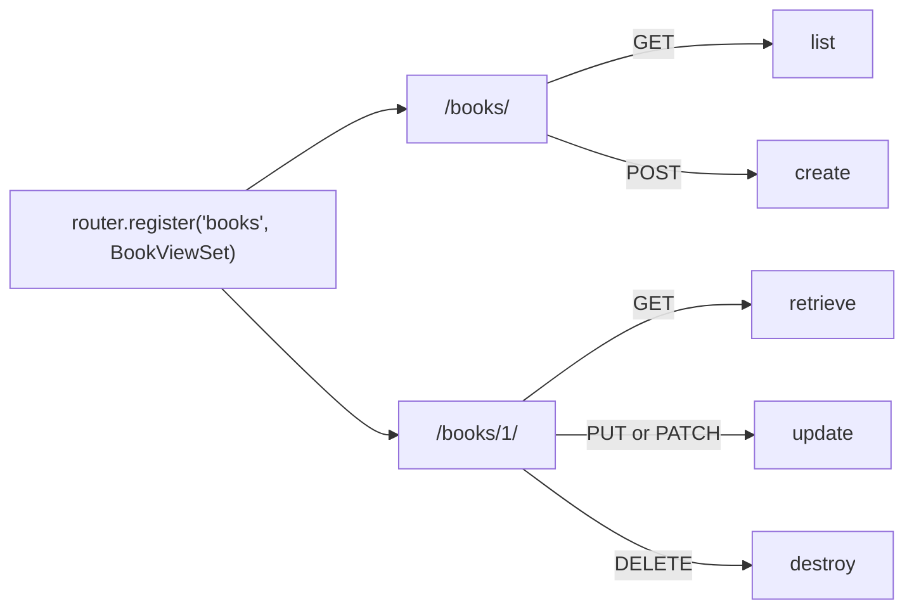

# A full CRUD API in 15 lines

## The big idea

An **API** is a set of web addresses that other programs (a phone app, a website's
JavaScript, another server) use to read and change your data. Instead of HTML
pages, it sends back JSON.

Most APIs are built around **resources**: kinds of things, like books, tasks or
users. For each resource, clients want to do the same five jobs: see the list, add
one, look at one, change one, delete one. Together these are called **CRUD**:
**C**reate, **R**ead, **U**pdate, **D**elete.

Writing a separate view for each of the five jobs means writing the same code
again and again. Django REST framework (DRF) bundles them:

- a **`ModelSerializer`** turns a model into JSON and back, with fields built from the model;
- a **`ModelViewSet`** is one class that does all five jobs;
- a **router** creates the web addresses for the viewset.

It's like `df.describe()` in pandas: one call does many standard calculations you
could write by hand, because everybody needs the same ones.



## New words

| word | meaning |
|---|---|
| **API** | Web addresses meant for programs, not people. They send and receive JSON. |
| **resource** | One kind of thing your API manages, like books. It usually matches a model. |
| **CRUD** | Create, Read, Update, Delete: the four basic things you do with data. |
| **REST** | A common style for APIs: one address per resource, and the HTTP method (`GET`, `POST`, ...) says what to do with it. |
| **collection URL** | The address for the whole list, like `/books/`. |
| **detail URL** | The address for one item, using its id, like `/books/1/`. |
| **status code** | The number at the top of every response that says how it went: `200` OK, `201` created, `204` done with nothing to send back, `400` bad input, `404` not found. |
| **queryset** | A "which rows?" question to the database, like `Book.objects.order_by("id")`. |
| **ViewSet** | One class that handles all the actions for one resource. |
| **router** | An object that looks at a ViewSet and makes the URLs for it. |

## What your code receives and returns

You don't call your code yourself. **The tests log in as a user and send real HTTP
requests to your URLs**, as a browser or app would. Before each test, they create
these two books (copied from the tests):

```python
Book.objects.create(title="Dune", author="Frank Herbert", published_year=1965)
Book.objects.create(title="Emma", author="Jane Austen", published_year=1815)
```

The `Book` model is already written for you in `sandbox/models.py`. It has the
fields `title` (text), `author` (text) and `published_year` (a whole number that
may be left empty). Django also gives every model an `id` automatically.

Here's what the tests send and what they expect back:

| test | request | expected response |
|---|---|---|
| 1 | `GET /books/` | `200`, a list of both books, Dune first, then Emma |
| 2 | `GET /books/<Dune's id>/` | one book with exactly the keys `id`, `title`, `author`, `published_year` |
| 3 | `POST /books/` with `{"title": "Beloved", "author": "Toni Morrison"}` | `201`, the book is saved, and the reply includes its new `id` |
| 4 | `POST /books/` with `{"author": "Anonymous"}` | `400`, and the error names the `title` field |
| 5 | `PATCH /books/<Dune's id>/` with `{"published_year": 1966}` | `200`, year is now 1966, title still `"Dune"` |
| 6 | `DELETE /books/<Emma's id>/` | `204`, and Emma is gone from the database |
| 7 | `GET /books/999/` | `404`, no such book |

For test 1 the reply body looks like this (the ids are picked by the database):

```python
[
    {"id": 1, "title": "Dune", "author": "Frank Herbert", "published_year": 1965},
    {"id": 2, "title": "Emma", "author": "Jane Austen", "published_year": 1815},
]
```

And for test 4:

```python
{"title": ["This field is required."]}
```

You don't write any of that logic yourself. `ModelViewSet` already knows how to
list, create, update and delete, and how to answer `400` and `404`. Your job is to
tell it **which model**, **which fields** and **which URL**.

## Tools you'll use

You can run all these examples in the Console: the `Book` model and a practice
database are there for you, and the imports at the top of your file are loaded.
The database starts empty on every run.

### Class attributes and `class Meta`

- In this exercise you write classes with **no methods**. You only set a few
  variables inside the class body, like `name = value`, indented under `class ...:`.
  DRF reads those variables to know what to do.
- `class Meta:` is a small class **inside** another class. It's DRF's (and
  Django's) place for settings about the outer class. You don't call it; you just
  write it.

### `Book.objects.order_by("id")`

- `Book.objects` is how you ask the database about books. `.order_by("id")` gives
  back a **queryset**: all books, sorted by id. A `-` in front sorts backwards.
- It's a **method** on `Book.objects`, with the field name as a string in `()`.

```python
matilda = Book.objects.create(title="Matilda", author="Roald Dahl", published_year=1988)
Book.objects.create(title="Coraline", author="Neil Gaiman")
print(matilda.id, matilda.title, matilda.published_year)
print(Book.objects.order_by("-id"))
# 1 Matilda 1988
# <QuerySet [<Book: Coraline>, <Book: Matilda>]>
```

Without an order, a database may return rows in any order it likes. Test 1 needs
Dune before Emma every time, so sort by `id`.

### `serializers.ModelSerializer`

- Like the `Serializer` from exercise 5, but it **reads the fields from a
  model**, so you don't list each field's type. You only say which model, and
  which fields to include, in `class Meta`.
- `Serializer(book).data` turns a book into a dictionary (then JSON).
  `Serializer(data=...)` checks incoming data, and `.errors` says what's wrong.

Here's one with a **different** field list from the one you need:

```python
class ShortBookSerializer(serializers.ModelSerializer):
    class Meta:
        model = Book
        fields = ["title", "author"]

matilda = Book.objects.create(title="Matilda", author="Roald Dahl", published_year=1988)
print(ShortBookSerializer(matilda).data)

incoming = ShortBookSerializer(data={"author": "Anonymous"})
print(incoming.is_valid())
print(incoming.errors)
# {'title': 'Matilda', 'author': 'Roald Dahl'}
# False
# {'title': [ErrorDetail(string='This field is required.', code='required')]}
```

`ErrorDetail(...)` is how the error looks inside Python. In the JSON reply it
becomes plain text: `{"title": ["This field is required."]}`. The `id` field is
**read-only** automatically: clients can see it, but they can't set it.

### `viewsets.ModelViewSet`

- A class that does list, create, retrieve (one item), update and delete for you.
- It needs two class attributes: `queryset` (which rows it works with) and
  `serializer_class` (which serializer turns them into JSON). Note that you give it
  the serializer **class itself**, `BookSerializer`, without `()`.

### `DefaultRouter()` and `router.register(...)`

- `router = DefaultRouter()` makes an empty router. Then
  `router.register(prefix, ViewSetClass, basename=...)` adds a viewset to it:
    - `prefix` is the start of the URL, as a string, **without slashes**: `"things"`
      becomes `/things/`;
    - `basename` is a short name used to name the URLs (`thing-list`, `thing-detail`).
- `router.urls` is the finished list of URLs, which Django reads from a variable
  called `urlpatterns`.

Here's a router for a made-up, empty viewset, just to see which URLs it makes:

```python
class ThingViewSet(viewsets.ModelViewSet):
    pass

demo = DefaultRouter()
demo.register("things", ThingViewSet, basename="thing")
for url in demo.urls:
    print(url.pattern, "->", url.name)
# ^things/$ -> thing-list
# ^things\.(?P<format>[a-z0-9]+)/?$ -> thing-list
# ^things/(?P<pk>[^/.]+)/$ -> thing-detail
# ^things/(?P<pk>[^/.]+)\.(?P<format>[a-z0-9]+)/?$ -> thing-detail
#  -> api-root
# <drf_format_suffix:format> -> api-root
```

The patterns look scary, but read them like this: `^things/$` is the collection URL
`/things/`, and `(?P<pk>[^/.]+)` means "an id goes here", so `^things/(?P<pk>...)/$`
is the detail URL `/things/1/`. The `format` lines are extra versions like
`/things.json`, and `api-root` is a front page listing your resources.

The router connects each URL and HTTP method to one action of the viewset:

| URL | `GET` | `POST` | `PUT` / `PATCH` | `DELETE` |
|---|---|---|---|---|
| `/books/` | list | create | | |
| `/books/{id}/` | retrieve | | update | destroy |

`PUT` replaces the whole book, so every required field must be sent. `PATCH`
changes only the fields you send.

**Try it:** paste any example above into the editor, highlight it and press
**Shift+Enter**. The result appears in the Console tab. Delete it again afterwards.

## Step by step

All the tests call your URLs, so **nothing can pass until all four steps are
done**. Write them all, then run the tests. After that, each step is what the
listed tests depend on.

1. **Finish `BookSerializer`.** Inside it, replace `pass` with a `class Meta:` that
   sets `model = Book` and `fields` to a list of the four names `"id"`, `"title"`,
   `"author"` and `"published_year"`. **→ tests 2, 3 and 4**
2. **Finish `BookViewSet`.** Replace `pass` with two class attributes:
   `queryset`, set to all books **ordered by `id`**, and `serializer_class`, set to
   `BookSerializer`. **→ tests 1, 5, 6 and 7**
3. **Make a router and register the viewset.** Below the classes, create a
   `DefaultRouter()` and store it in a variable called `router`. Register
   `BookViewSet` on it with the prefix `"books"` and `basename="book"`.
4. **Hand the URLs to Django.** Change `urlpatterns = []` so it holds the router's
   URLs, `router.urls`. It must come **after** the register line. **→ all of tests 1-7**

## Common mistakes

- **Errors like `Content-Type header is "text/html..."` or `200 != 201`**:
  `urlpatterns` is still empty, so Django answers every address with its HTML
  welcome page instead of your API. Do steps 3 and 4.
- **Every test fails with `404`**: the URLs exist, but not at `/books/`. Check the
  prefix is exactly `"books"` and that `urlpatterns = router.urls` comes after
  `router.register(...)`.
- **Writing `"/books/"` as the prefix**: use just `"books"`, the router adds the
  slashes.
- **`serializer_class = BookSerializer()`** with brackets: give the class, not an
  object made from it.
- **Test 1 has the books in the wrong order**: the queryset isn't sorted. Use
  `order_by("id")`.
- **Test 2 fails with a missing or extra key**: check the spelling of the four
  names in `fields`, especially `published_year`.

## Why it matters

This is how most Django REST APIs are built: a model, a `ModelSerializer`, a
`ModelViewSet` and a router. In the next exercises you'll add rules to this same
setup: who may do what, filtering and pages of results.
